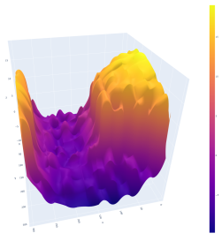

# InSAR
## Содержание 
1. [Содержание](#content)
2. [Краткое описание](#summary)
3. [Используемые сторонние библиотеки](#libs)
4. [Структура репозитория](#structure)

## Краткое описание 
Создание цифровой модели рельефа по радиолокационным интерферометрическим снимкам с некогерентным накоплением.

 Пример обработки данных 

| Способ отображения/Этап обработки | Фаза до развертки | Фаза после развертки |
| :-------------------------------: | :---------------: | :------------------: |
| Полутоновое изображение |  |  |
| Поверхность |  |  |

## Используемые сторонние библиотеки 

scipy, progress, opencv-python 

 После установки сторонних библиотек и клонирования репозитория, можно запускать скрипты с помощью интерпретатора python3.

## Структура репозитория 
<ul>
<li> insar 
  <ul>
    <li> filtering 
      <ul>
         <li> complex.py   </li>
         <li> amplitude.py </li>
         <li> phase.py     </li>
      </ul>
    </li>
    <li> unwrapping 
      <ul>
         <li> algorithms.py   </li>
         <li> masks.py        </li>
         <li> quality_maps.py </li>
      </ul>
    </li>
    <li> zpt_scripts
      <ul>
        <li> hlgio.py </li>
        <li> ph.py </li>
      </ul>
    </li>
    <li> alignment.py </li>
    <li> auxiliary.py </li>
    <li> compensate.py </li>
    <li> data_io.py </li>
  </ul>
</li>
<li> processing_scripts 
   <ul>
      <li> compensating.py       </li>
      <li> make_quality_maps.py  </li>
      <li> npy_3d_htnl.py        </li>
      <li> npy_kuan_npy.py       </li>
      <li> npy_trfm_bmp.py       </li>
      <li> npy_unwrap_npy.py     </li>
      <li> params_test.py        </li>
      <li> phase_filtering.py    </li>
      <li> rli_npy.py           </li>
      <li> unwrapping.py        </li>
   </ul>
</li>
</ul>

 Вычислительные модули расположены в папке insar. Скрипты, использующие вычислитльные модули для обработки файлов расположены в папке processing_scsripts. 

 В качестве примеров использования вычислительных модулей удобно использовать код скриптов из папки processing_scipts. Описание использования самих скриптов можно найти в шапках самих файлов

